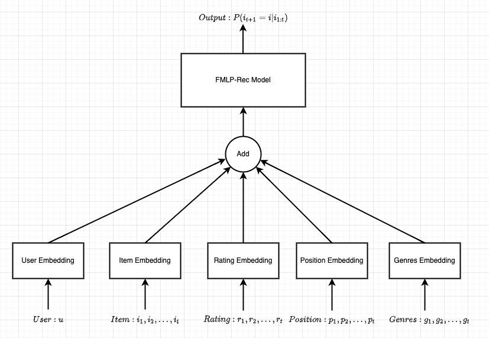

# combining interpretability and filtering algorithm for Sequence recommendation

## Model


## Quick-Start

预处理数据：
```sh
make setup
```

训练：
```sh
make train
```

## 执行方式
+ 展示虚拟环境
```sh
conda env list
```
+ 激活虚拟环境
```sh
source activate <虚拟环境名字>
```
+ 执行方式
    + 处理数据集
    ```sh
    make setup
    ```
    + 运行train
    ```sh
    make train
    ```
    + 运行eval
    ```sh
    make eval
    ```